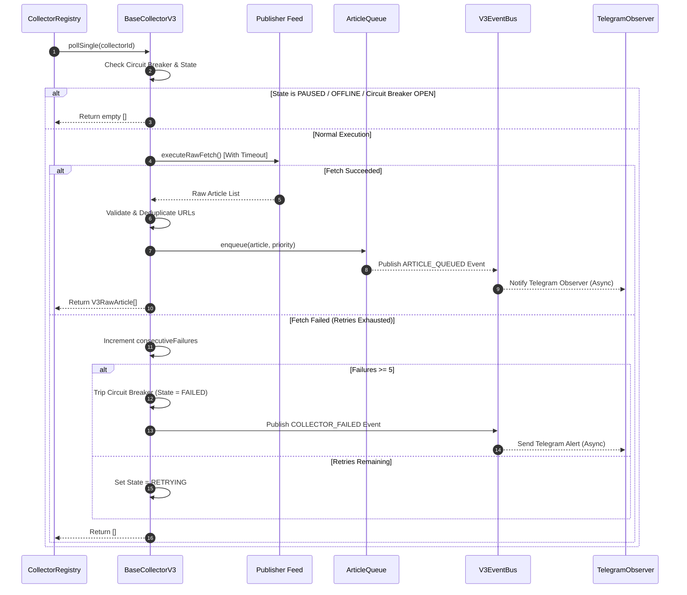

# ATHENA NewsEngineV3 — Collector Ingestion Sequence Diagram

```mermaid
sequenceDiagram
    autonumber
    participant Reg as CollectorRegistry
    participant Col as BaseCollectorV3
    participant Pub as Publisher Feed
    participant Q as ArticleQueue
    participant Bus as V3EventBus
    participant Tel as TelegramObserver

    Reg->>Col: pollSingle(collectorId)
    Col->>Col: Check Circuit Breaker & State
    alt State is PAUSED / OFFLINE / Circuit Breaker OPEN
        Col-->>Reg: Return empty []
    else Normal Execution
        Col->>Pub: executeRawFetch() [With Timeout]
        alt Fetch Succeeded
            Pub-->>Col: Raw Article List
            Col->>Col: Validate & Deduplicate URLs
            Col->>Q: enqueue(article, priority)
            Q-->>Bus: Publish ARTICLE_QUEUED Event
            Bus-->>Tel: Notify Telegram Observer (Async)
            Col-->>Reg: Return V3RawArticle[]
        else Fetch Failed (Retries Exhausted)
            Col->>Col: Increment consecutiveFailures
            alt Failures >= 5
                Col->>Col: Trip Circuit Breaker (State = FAILED)
                Col->>Bus: Publish COLLECTOR_FAILED Event
                Bus-->>Tel: Send Telegram Alert (Async)
            else Retries Remaining
                Col->>Col: Set State = RETRYING
            end
            Col-->>Reg: Return []
        end
    end
```
