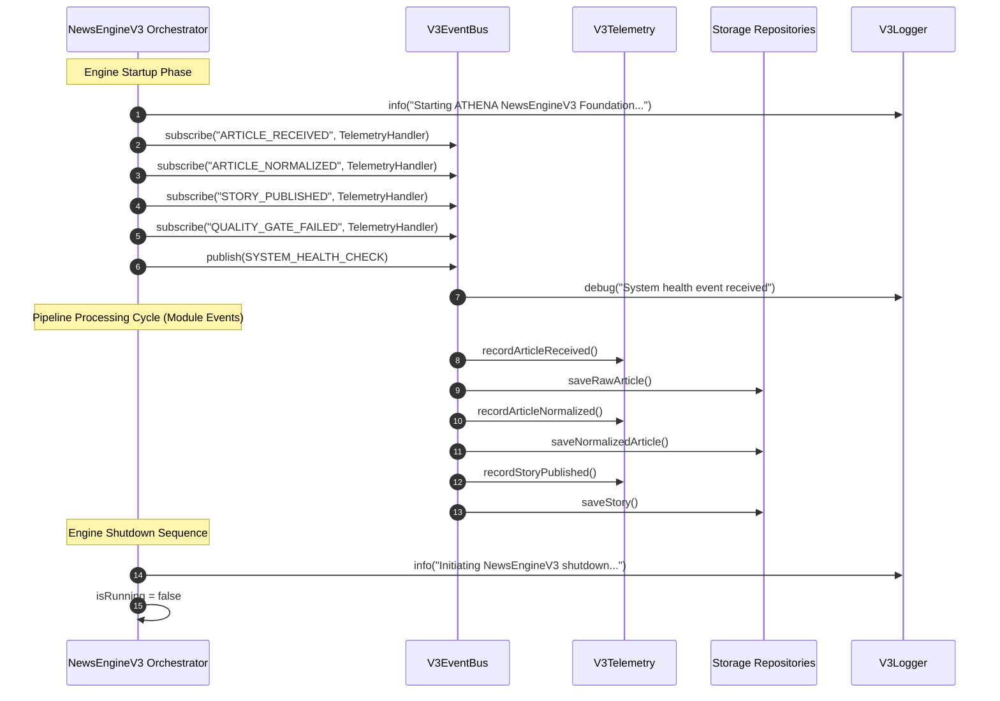

# ATHENA NewsEngineV3 — Event Sequence Diagrams

## Master Event Flow Sequence

```mermaid
sequenceDiagram
    autonumber
    participant Engine as NewsEngineV3 Orchestrator
    participant EventBus as V3EventBus
    participant Telemetry as V3Telemetry
    participant Storage as Storage Repositories
    participant Logger as V3Logger

    Note over Engine: Engine Startup Phase
    Engine->>Logger: info("Starting ATHENA NewsEngineV3 Foundation...")
    Engine->>EventBus: subscribe("ARTICLE_RECEIVED", TelemetryHandler)
    Engine->>EventBus: subscribe("ARTICLE_NORMALIZED", TelemetryHandler)
    Engine->>EventBus: subscribe("STORY_PUBLISHED", TelemetryHandler)
    Engine->>EventBus: subscribe("QUALITY_GATE_FAILED", TelemetryHandler)
    
    Engine->>EventBus: publish(SYSTEM_HEALTH_CHECK)
    EventBus->>Logger: debug("System health event received")

    Note over Engine: Pipeline Processing Cycle (Module Events)
    EventBus->>Telemetry: recordArticleReceived()
    EventBus->>Storage: saveRawArticle()
    
    EventBus->>Telemetry: recordArticleNormalized()
    EventBus->>Storage: saveNormalizedArticle()

    EventBus->>Telemetry: recordStoryPublished()
    EventBus->>Storage: saveStory()

    Note over Engine: Engine Shutdown Sequence
    Engine->>Logger: info("Initiating NewsEngineV3 shutdown...")
    Engine->>Engine: isRunning = false
```
